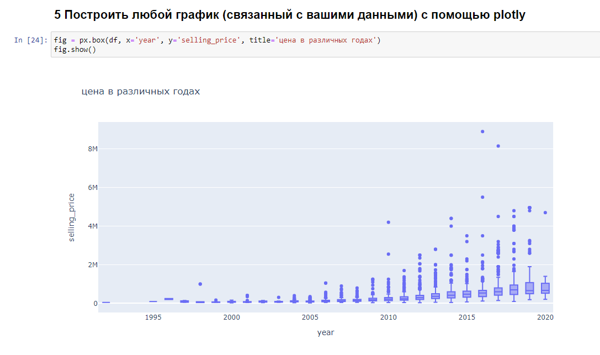

# Задание:
___

Визуализация данных
0 Загружаем в pandas любой набор данных, в котором есть как минимум пара числовых колонок и как минимум одна категориальная с небольшим числом категорий. Опишите ваши данные, что обозначает каждый столбец, какого типа (категориальный, вещественный, целочисленный, бинарный) данный столбец, при необходимости для категориальных в том числе бинарных признаков привести расшифровку их значений. В общем, проведите "визуальный" анализ ваших данных.
1 Matplotlib
1.1 Построить любой график (любого рода) с помощью чистого matplotlib / pylab
1.2 Построить несколько суб-графиков на одном графике используя .subplot.
Графики должны быть разных типов и хотя бы два из них должны быть связаны с вашим датасетом. Хотя бы в одном графике подпишите оси. Во всех графиках подписать название графика.
2 На основе Вашего датасета построить три разных вида графиков используя pandas.DataFrame.plot / Series.plot (мануал) Среди графиков должен присутствовать один boxplot (обязательно надо использовать параметр by, для исследования взаимосвязи числовой переменной и какой-либо другой). Графики должны быть построены как через методы DataFrame, так и через методы Series. То есть оба варианта нужно продемонстрировать.
3 Seaborn
3.1 Построить .pairplot с помощью seaborn на каком-либо наборе данных, проанализировав взаимосвязь набора числовых переменных
3.2 Построить .jointplot, проанализировав взаимосвязь двух конкретных числовых переменных
3.3 Построить .boxplot или .violinplot на каком-либо наборе данных, проанализировав какой-то числовой показатель в разрезе категориального
3.4 Построить график heatmap попарной корреляции всех числовых признаков (категориальные признаки убираете из графика)
5 Построить любой график (связанный с вашими данными) с помощью plotly

# Программа:
[Laba6.ipynb](Laba6.ipynb)

# Фотография для 5 пункта
